# AWS Cost-Optimized Architectures — Learning Activity Portfolio

<!-- markdownlint-disable MD022 MD024 MD032 MD034 MD036 MD060 -->

This document is written as a learning activity and assessment artifact. Each task is a mini-case study: I restate the business problem, describe the AWS design decision(s), and document the console implementation evidence.

## How to Use This Portfolio

For each task, you can evaluate:

- Requirements coverage: does the solution meet the stated SLAs and constraints?
- Cost reasoning: are the largest cost drivers identified and addressed?
- AWS best practices: security, reliability, and operability trade-offs are called out.
- Evidence quality: screenshots are explicitly enumerated and tied to requirements.

## Learning Outcomes (Across Tasks)

By completing this portfolio, I demonstrate the ability to:

- Design S3 storage class and lifecycle policies based on access/restoration requirements
- Replace always-on compute with managed/serverless alternatives where appropriate
- Implement budget guardrails and tag-based cost allocation
- Right-size EC2 and EBS based on observed utilization
- Compare NAT Gateway vs NAT Instance costs and operational trade-offs

## Evidence Standard (Applies to All Tasks)

For each task, I include (or list placeholders for):

- Screenshots of key console settings (with region visible)
- A short justification tied directly to requirements and cost optimization
- A brief risk/trade-off note (what I gain vs what I give up)

---

## Task 1 — S3 Lifecycle Design for Backups and Profile Pictures

### Scenario

The company needs to store unstructured data in a centralized location with a consistent destination URL to simplify API calls for the development team. This storage will also serve as the backup destination.

The backup team has identified the following access patterns and restoration requirements:

**0–30 days**: Data is accessed frequently, requiring restoration within seconds.

**31–90 days**: Data access drops to once or twice per month, with restoration still needed within seconds.

**Beyond 90 days**: Data is rarely accessed, with a restoration SLA of up to 2 hours.

**Beyond 6 months**: Data is stored primarily for compliance, with a restoration SLA of up to 24 hours.

**After 1 year**: Data should be deleted.

Additionally, this storage location will host user profile pictures uploaded by the application. These images are non-critical, as users can re-upload them if lost. However, they are accessed frequently, as each user profile load on the web application triggers an image retrieval.

Create one or more S3 bucket(s) and configure them to meet the access/retrieval SLAs and cost goals.

### Rubric
- Create the appropriate resources in the AWS console
  - Include screenshots of the service(s) created and the configuration of those services. Include a justification paragraph for the services created.

### Student Submission

### Solution Overview

To meet the business requirements, I created a single S3 bucket with two distinct prefixes to separate the backup data from user profile pictures. This approach provides a consistent destination URL while allowing different lifecycle policies for each data type.

**Bucket Structure:**
- `backups/` — Stores backup data with tiered lifecycle transitions
- `profile-pictures/` — Stores user-uploaded profile images

### Backup Data Lifecycle Policy (`backups/` prefix)

The backup lifecycle policy transitions objects through increasingly cost-effective storage classes based on the specified access patterns and restoration SLAs:

| Age | Storage Class | Justification |
|-----|---------------|---------------|
| 0–30 days | S3 Standard | Frequently accessed data with millisecond retrieval. Highest cost but necessary for operational needs. |
| 31–90 days | S3 Standard-IA (Infrequent Access) | Reduced access frequency (1–2 times/month). Lower storage cost with same millisecond retrieval. Minimum 30-day storage requirement aligns perfectly with this transition. |
| 91–180 days | S3 Glacier Flexible Retrieval | Rarely accessed with 2-hour restoration SLA. Expedited retrieval (1–5 minutes) or Standard retrieval (3–5 hours) both meet the requirement. Significant cost savings. |
| 181–365 days | S3 Glacier Deep Archive | Compliance storage with 24-hour SLA. Standard retrieval (within 12 hours) meets requirement. Lowest storage cost for long-term retention. |
| After 365 days | Delete (Expiration) | Objects are permanently deleted after 1 year per business requirement. |

### User Profile Pictures Policy (`profile-pictures/` prefix)

| Storage Class | Justification |
|---------------|---------------|
| S3 One Zone-IA | Cost-optimized choice for non-critical, frequently accessed data. Since users can re-upload images if lost, the reduced durability of single-AZ storage is acceptable. Provides ~20% cost savings compared to Standard-IA while still offering millisecond retrieval for the frequent profile loads. |

**Note:** No lifecycle transitions or expiration rules are configured for profile pictures since they need to remain available as long as the user account is active.

**Implementation detail:** S3 does not support “default storage class by prefix.” To place profile pictures into One Zone-IA immediately (instead of waiting 30+ days for lifecycle transitions), the uploader must set the object storage class at upload time (e.g., `x-amz-storage-class: ONEZONE_IA`, AWS CLI `--storage-class ONEZONE_IA`, or SDK `StorageClass="ONEZONE_IA"`).

### Additional Bucket Configuration

- **Versioning:** Disabled (backups are typically point-in-time snapshots; profile pictures are user-replaceable)
- **Server-Side Encryption:** Enabled with SSE-S3 (AES-256) for data protection at rest
- **Block Public Access:** Enabled for all settings (access controlled via application IAM roles/policies)

### Cost Optimization Summary

This solution optimizes costs by:
1. **Automatic tiering** — Data automatically moves to cheaper storage classes as it ages
2. **Automatic deletion** — Backup data is purged after 1 year, eliminating unnecessary storage costs
3. **One Zone-IA for non-critical data** — Profile pictures use lower-cost storage appropriate for their non-critical nature
4. **Single bucket architecture** — Reduces management overhead while maintaining logical separation via prefixes

### Screenshots

**Bucket Properties: Block Public Access**
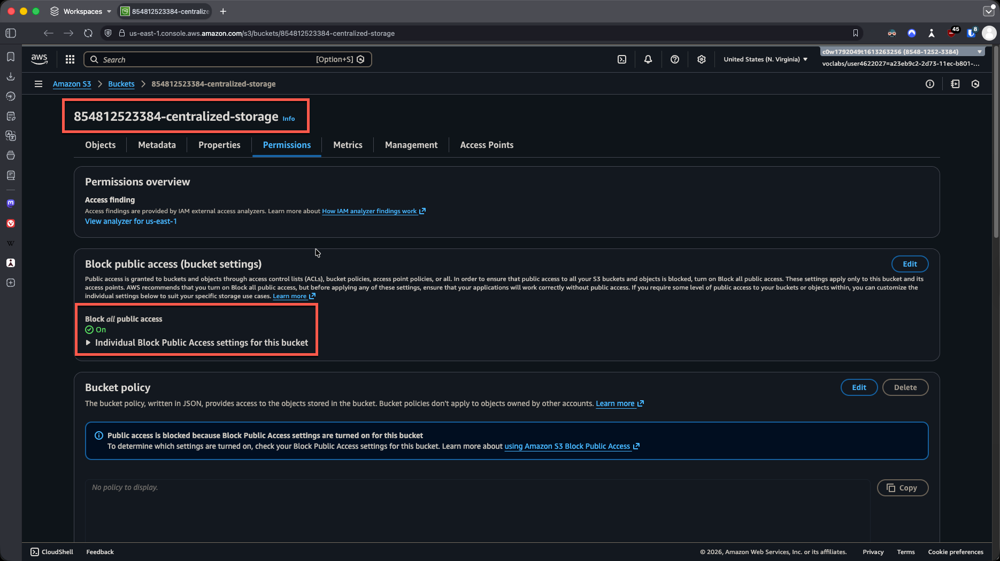

**Bucket Properties: Encryption**
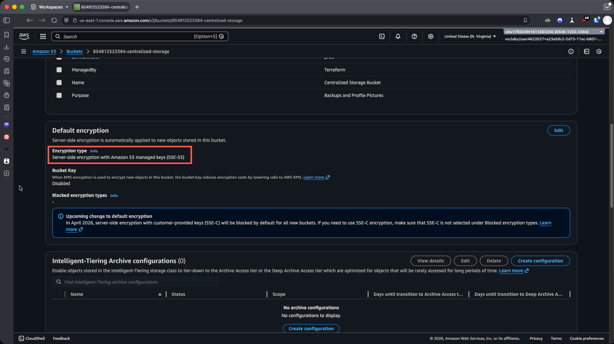

**Lifecycle Rule List**
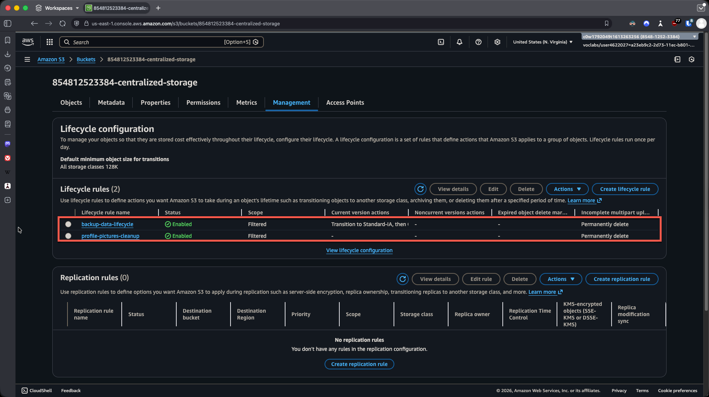

**`backups/` Rule Details**


**`profile-pictures/` Rule Details**


**Bucket Objects**
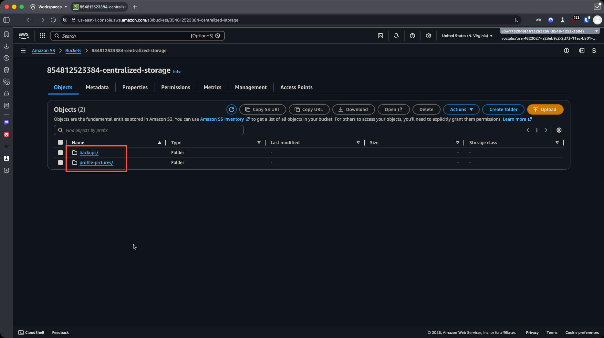

---

## Task 2 — Cost-Optimized Hosting for a Company Website

### Scenario
Nexlify Solutions has been hosting its company website on Amazon EC2 instances for some time. Recently, the CIO has reviewed the AWS billing reports and raised concerns about the high monthly costs associated with running the website. This concern was amplified after discussions with peers at other companies who mentioned they operate their websites for just a few dollars per month.

Additionally, usage metrics from the marketing team indicate that website traffic primarily occurs during business hours, with minimal activity outside those times.

As the AWS Solutions Architect, your task is to evaluate the current infrastructure, identify opportunities for cost savings, and implement a more cost-efficient solution for hosting the website. The solution should align with the traffic patterns and business requirements. Once the solution is in place, decommission any unnecessary legacy infrastructure that is not required for hosting this website.

Be sure to document findings, the target architecture, and decommission steps.

### Rubric
- Create the appropriate resources in the AWS console
  - Include screenshots of the service(s) created and the configuration of those services. Include a justification paragraph for the services created.

### Student Submission

### Current Environment Findings

Upon reviewing the existing infrastructure, I found:

- EC2 instances running 24/7 to host the company website
- Website content appears to be static (HTML, CSS, JavaScript, images)
- Traffic patterns show activity primarily during business hours with minimal overnight/weekend usage
- EC2 instances incur costs regardless of traffic volume (compute, storage, potentially Elastic IP)

**Problem:** Running EC2 instances for a static website is significantly over-engineered and expensive. EC2 is designed for dynamic, compute-intensive workloads—not serving static files.

### Recommended Solution: S3 Static Website Hosting + CloudFront

Since peers mentioned hosting websites for "a few dollars per month," this strongly indicates **static website hosting**. The solution is to migrate from EC2 to:

1. **Amazon S3** — Static website hosting
2. **Amazon CloudFront** — Content Delivery Network (CDN) for global distribution and HTTPS

### Implementation Steps

#### Step 1: Create S3 Bucket for Static Website Hosting

- Create an S3 bucket with a name matching the website domain (e.g., `www.nexlify.com`)
- Enable **Static Website Hosting** in bucket properties
- Configure index document (`index.html`) and error document (`error.html`)
- Upload all website files (HTML, CSS, JS, images) to the bucket

#### Step 2: Configure CloudFront Distribution

- Create a CloudFront distribution with the S3 bucket as the origin
- Use **Origin Access Control (OAC)** to keep the S3 bucket private while allowing CloudFront access
- Configure HTTPS with AWS Certificate Manager (ACM) for SSL/TLS
- Set appropriate cache behaviors for static content (longer TTLs for images/CSS/JS)

#### Step 3: Update DNS

- Update Route 53 (or external DNS) to point the domain to the CloudFront distribution
- Create alias records for both apex domain and www subdomain

#### Step 4: Decommission Legacy Infrastructure

- Terminate EC2 instances used for website hosting
- Delete associated resources:
  - EBS volumes (if not set to delete on termination)
  - Elastic IP addresses (to avoid charges for unattached IPs)
  - Security groups (if no longer needed)
  - Load balancers (if applicable)

### Cost Comparison

| Component | EC2 Hosting (Before) | S3 + CloudFront (After) |
|-----------|---------------------|------------------------|
| Compute | t3.medium ~$30/month | $0 (serverless) |
| Storage | EBS ~$8/month (100GB) | S3 ~$0.50/month (few GB) |
| Data Transfer | EC2 egress ~$9/100GB | CloudFront ~$8.50/100GB (with free tier benefits) |
| **Total (estimated)** | **~$47+/month** | **~$1-5/month** |

*Actual savings depend on current instance type, storage, and traffic volume.*

### Why This Solution Meets Business Requirements

1. **Dramatic cost reduction** — From ~$50+/month to a few dollars, matching what peers mentioned
2. **Traffic pattern alignment** — Pay only for actual usage; no idle compute costs during off-hours
3. **Improved performance** — CloudFront edge locations provide faster global content delivery
4. **High availability** — S3 offers 99.99% availability; CloudFront provides built-in redundancy
5. **Zero maintenance** — No OS patching, security updates, or instance management required
6. **Auto-scaling** — Handles traffic spikes without manual intervention

### Screenshots

**S3 Bucket Static Hosting Enabled**
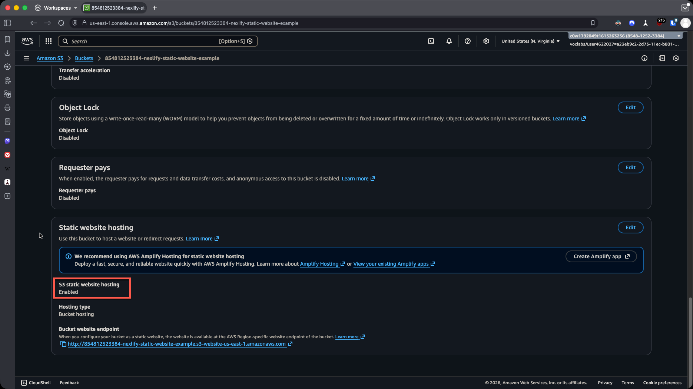

**S3 Bucket Block Public Access**
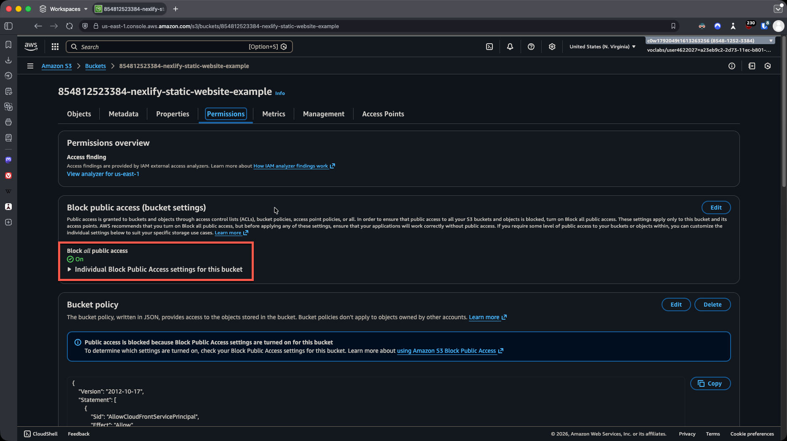

**CloudFront Distribution Settings**
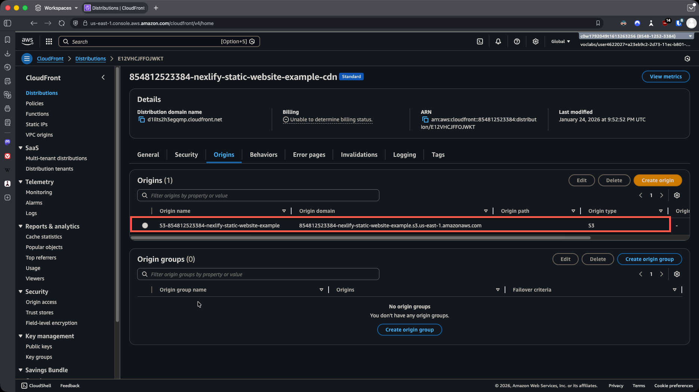

---

## Task 3 — Budget Guardrails and Tag-Based Cost Allocation

### Scenario
You are a Cloud Solutions Architect for a digital marketing startup, “AdSpark”, which has just moved most of its infrastructure to AWS.

The CFO is concerned about runaway AWS costs, especially since engineers are testing new services without any spending limits. She has asked you to implement cost controls to prevent monthly surprises.

Business Requirements:

- The company has set a monthly cloud budget of $1,000 for all AWS services - Production and Development.
- They need an email alert if the following occurs:
  - 50% of the budget (early warning)
  - 80% of the budget (urgent action required)
- Document - How will you meet the requirements to ensure that other administrators can easily identify which resources belong to:
  - A specific environment (e.g., Production or Development)?
  - A specific team (e.g., Marketing, Analytics, Engineering)?
- Document - How can the above method be used to effectively break down costs by:
  - Environment (Production vs. Development)?
  - Team ownership (Marketing, Analytics, Engineering)?
  
### Rubric
- Create the appropriate configurations in the AWS console
  - Include screenshots of the service(s) created and the configuration of those services. Include a justification paragraph for the services created.

### Student Submission

### Solution Overview

To address the CFO's concerns about runaway AWS costs, I implemented a two-part solution:

1. **AWS Budgets** — For proactive cost monitoring and alerting
2. **Resource Tagging Strategy** — For resource identification and cost allocation

---

### Part 1: AWS Budget Configuration

#### Budget Setup

I created an AWS Budget with the following configuration:

| Setting | Value |
|---------|-------|
| Budget Type | Cost Budget |
| Budget Name | AdSpark-Monthly-Budget |
| Period | Monthly (recurring) |
| Budget Amount | $1,000 |
| Start Month | Current month |

#### Alert Thresholds

| Alert | Threshold | Type | Notification |
|-------|-----------|------|--------------|
| Early Warning | 50% ($500) | Forecasted & Actual | Email to finance-alerts@adspark.com |
| Urgent Action | 80% ($800) | Forecasted & Actual | Email to finance-alerts@adspark.com, ops-team@adspark.com |

**Alert Configuration Details:**
- **Forecasted alerts** — Notify when AWS predicts spending will exceed the threshold by month-end
- **Actual alerts** — Notify when actual spending crosses the threshold
- Both alert types are configured to ensure early visibility into potential overruns

---

### Part 2: Resource Tagging Strategy

#### Tagging Schema

To ensure administrators can easily identify resource ownership, I recommend implementing the following mandatory tags on all AWS resources:

| Tag Key | Purpose | Example Values |
|---------|---------|----------------|
| `Environment` | Identifies the deployment environment | `Production`, `Development`, `Staging`, `QA` |
| `Team` | Identifies the owning team | `Marketing`, `Analytics`, `Engineering` |
| `Project` | Identifies the associated project | `AdCampaign`, `DataPipeline`, `WebApp` |
| `CostCenter` | For finance/accounting allocation | `CC-1001`, `CC-1002` |

#### Example Resource Tags

**Production Analytics Server:**

```text
Environment: Production
Team: Analytics
Project: DataPipeline
CostCenter: CC-1002
```

**Development Marketing Application:**

```text
Environment: Development
Team: Marketing
Project: AdCampaign
CostCenter: CC-1001
```

#### Enforcing the Tagging Strategy

To ensure compliance with the tagging policy:

1. **AWS Organizations Tag Policies** — Create and attach tag policies to enforce allowed values
2. **AWS Config Rules** — Use `required-tags` managed rule to detect non-compliant resources

---

### Part 3: Cost Breakdown Using Tags

#### Activating Cost Allocation Tags

To break down costs by Environment and Team:

1. Navigate to **AWS Billing Console** → **Cost Allocation Tags**
2. Activate the following tags as **Cost Allocation Tags**:
   - `Environment`
   - `Team`
3. Wait 24 hours for tags to appear in Cost Explorer reports

#### Using AWS Cost Explorer for Cost Analysis

Once Cost Allocation Tags are activated, use **AWS Cost Explorer** to analyze costs:

**By Environment (Production vs. Development):**
1. Open Cost Explorer
2. Select "Tag" as the dimension
3. Filter by tag key: `Environment`
4. View costs grouped by `Production` and `Development`

**By Team (Marketing, Analytics, Engineering):**
1. Open Cost Explorer
2. Select "Tag" as the dimension
3. Filter by tag key: `Team`
4. View costs grouped by team name

#### Sample Cost Report Views

| View | Group By | Filter |
|------|----------|--------|
| Environment Breakdown | Tag: Environment | None |
| Team Breakdown | Tag: Team | None |
| Production by Team | Tag: Team | Environment = Production |
| Development by Team | Tag: Team | Environment = Development |

---

### Screenshots

**Budget General Settings**
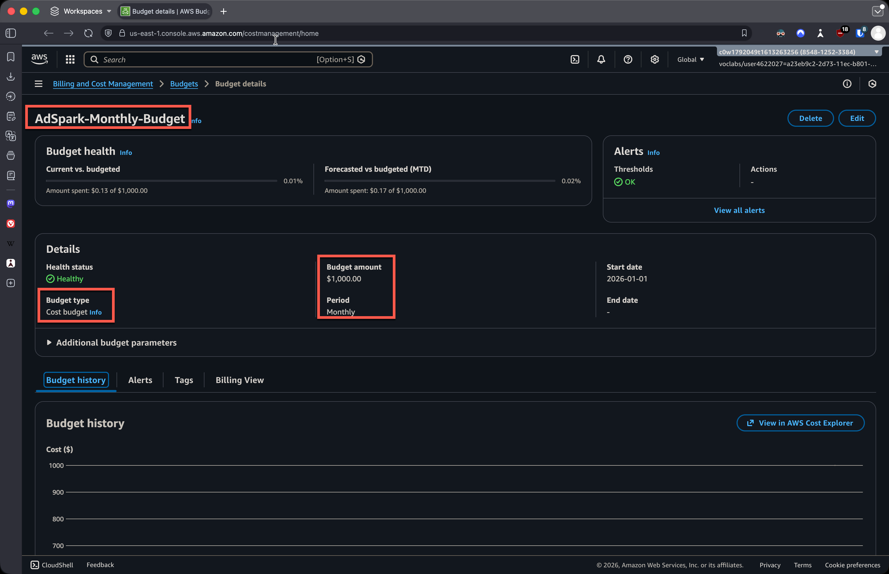

**Budget Alerts**
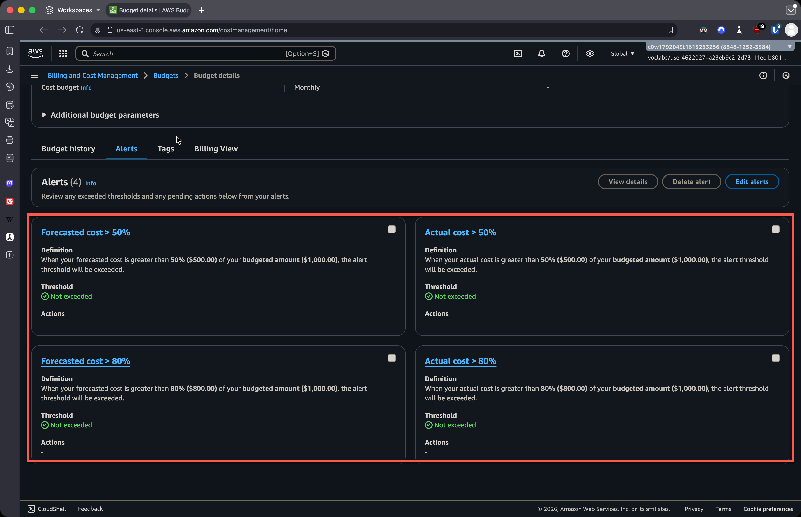

**Organization Tag Policy**
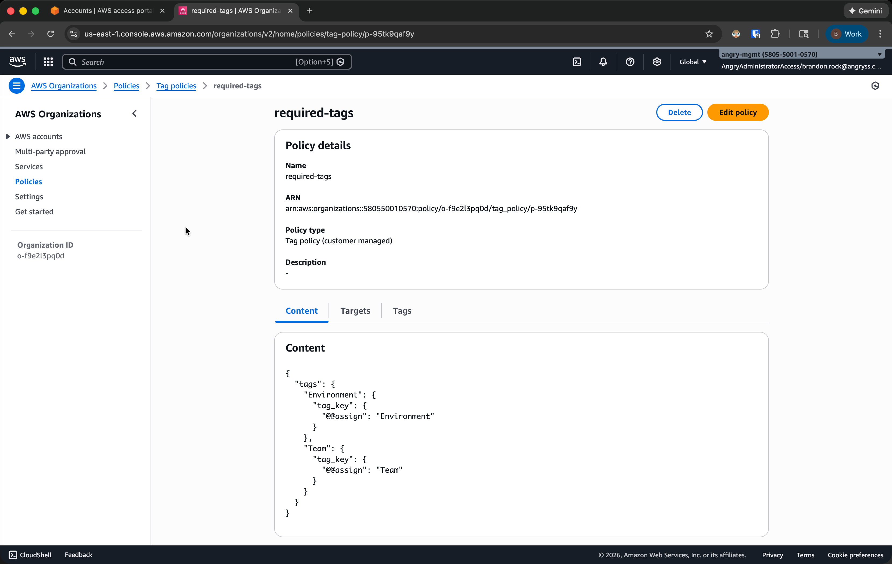

**Config Tags Required**
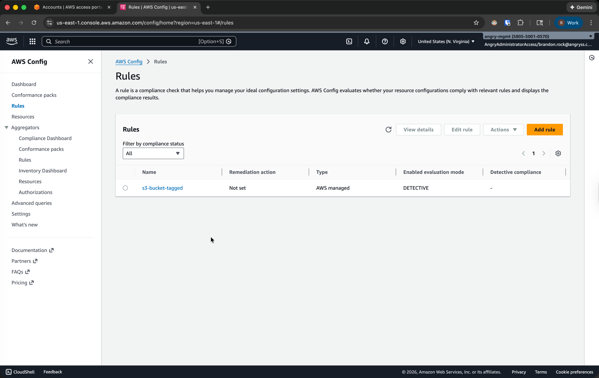

**Cost Allocation Tags**
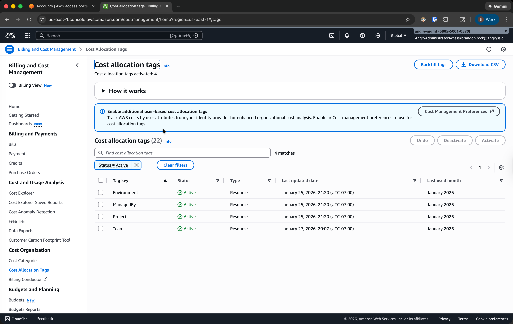

**`Team` and `Environment` Tags Applied**
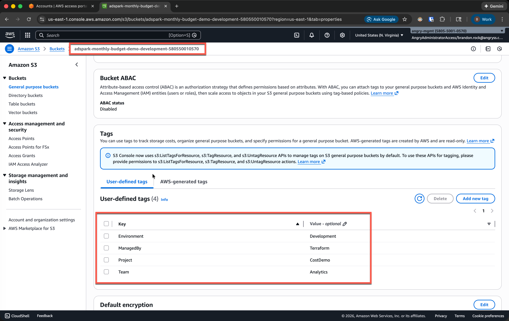

---

## Task 4 — EC2 and EBS Right-Sizing Based on Utilization

### Scenario
You are working for a software development company that has multiple EC2 instances, one instance - qa-instance-1 cost every month seems to be costing the company quite a lot compared to the other instances. The monitoring team has looked at the performance of the instance using a 3rd party monitoring tool and found the following:

- CPU utilization:
  - Peak : 70%
  - Off Peak: 40%
- Memory Usage:
  - Peak: 60%
  - Off Peak: 20%
- Disk IO Vol2:
  - Peak: 75 IOPS
  - Off Peak: 50 IOPS

Business Requirements:

Observe the configuration of qa-instance-1 and see if there are any recommendations you have to optimize the cost but still be able to meet performance requirements for peak performance.

Document your observations, and implement & document the steps by step changes for your solution.

### Rubric

- Create the appropriate changes to resources in the AWS console
  - Include screenshots of the service(s) created and the configuration of those services. Include a justification paragraph for the services created.

### Student Submission

### Current Findings

#### Instance Configuration (qa-instance-1)

Upon reviewing the current configuration of `qa-instance-1`, I observed:

| Resource | Current Configuration | Actual Usage (Peak) | Utilization |
|----------|----------------------|---------------------|-------------|
| Instance Type | *(To be documented from console)* | — | — |
| vCPUs | *(Current vCPU count)* | 70% peak utilization | Over-provisioned |
| Memory | *(Current memory)* | 60% peak utilization | Over-provisioned |
| Storage (Vol2) | *(Current IOPS provisioned)* | 75 IOPS peak | Significantly over-provisioned |

#### Key Observations

1. **CPU is under-utilized** — Peak usage of 70% suggests the instance has more compute capacity than needed. A smaller instance could handle the workload with headroom.

2. **Memory is under-utilized** — Peak usage of 60% indicates memory is over-provisioned. The instance could be downsized while still meeting requirements.

3. **Disk I/O is minimal** — 75 IOPS at peak is extremely low. This workload does not require high-performance storage. If using provisioned IOPS (io1/io2), this is wasteful.

4. **QA workload characteristics** — As a QA instance, this is likely not production-critical and may have intermittent usage patterns.

---

### Recommended Changes

#### 1. Right-Size the EC2 Instance

Based on the utilization metrics, I recommend downsizing to a smaller instance type:

| Metric | Recommendation |
|--------|----------------|
| Target CPU headroom | ~80% at peak (industry best practice) |
| Target Memory headroom | ~80% at peak |

**Instance Type Selection:**

If the current instance is oversized (e.g., `m5.xlarge` or larger), consider:

| Current Type | Recommended Type | Monthly Savings (On-Demand) |
|--------------|------------------|----------------------------|
| m5.xlarge (4 vCPU, 16GB) | t3.medium (2 vCPU, 4GB) | ~$110/month |
| m5.large (2 vCPU, 8GB) | t3.small (2 vCPU, 2GB) | ~$50/month |

*Note: Exact recommendation depends on actual current instance type.*

**Why T3 (Burstable)?**
- QA workloads typically have variable demand
- T3 instances earn CPU credits during idle periods
- Baseline + burst capability handles the 70% peak usage
- Significantly cheaper than fixed-performance instances

#### 2. Optimize EBS Storage

For the attached volume (Vol2) with only 75 IOPS peak requirement:

| Storage Type | Recommendation |
|--------------|----------------|
| If using io1/io2 | Switch to **gp3** |
| If using gp2 | Switch to **gp3** (or keep gp2) |

**gp3 Benefits:**
- Baseline of 3,000 IOPS (far exceeds the 75 IOPS requirement)
- 125 MB/s baseline throughput
- Lower cost than gp2 for most configurations
- No need to provision additional IOPS

#### 3. Consider Spot Instances (Optional)

Since this is a QA instance (non-production):
- **Spot Instances** can provide up to 90% cost savings
- QA workloads can typically tolerate interruptions
- Use Spot with persistent request or Spot Fleet for availability

---

### Implementation Steps

#### Step 1: Create AMI Backup
1. Select `qa-instance-1` in EC2 Console
2. Actions → Image and templates → Create image
3. Name: `qa-instance-1-backup-YYYYMMDD`
4. Wait for AMI to become available

#### Step 2: Stop the Instance
1. Select `qa-instance-1`
2. Instance state → Stop instance
3. Wait for instance to fully stop

#### Step 3: Change Instance Type
1. Select the stopped instance
2. Actions → Instance settings → Change instance type
3. Select the recommended smaller instance type
4. Click Apply

#### Step 4: Modify EBS Volume (if applicable)
1. Navigate to EC2 → Volumes
2. Select Vol2 attached to qa-instance-1
3. Actions → Modify volume
4. Change volume type to `gp3`
5. Set IOPS to 3000 (baseline, no additional cost)
6. Click Modify

#### Step 5: Start the Instance
1. Select `qa-instance-1`
2. Instance state → Start instance
3. Verify application functionality

---

### Cost Savings Summary

| Change | Estimated Monthly Savings |
|--------|--------------------------|
| Instance right-sizing (e.g., m5.xlarge → t3.medium) | ~$100 |
| EBS optimization (io1 → gp3, if applicable) | ~$50-100 |
| **Total Estimated Savings** | **~$100-200/month** |

*Actual savings depend on current configuration and region.*

---

### How This Meets Business Requirements

| Requirement | How It's Met |
|-------------|--------------|
| Handle peak CPU (70%) | Downsized instance still provides sufficient CPU with headroom |
| Handle peak memory (60%) | Right-sized memory allocation meets peak demand |
| Handle peak IOPS (75) | gp3 provides 3,000 IOPS baseline (40x headroom) |
| Cost optimization | Smaller instance + optimized storage = significant savings |
| Maintain performance | All peak metrics can be met with recommended configuration |

### Screenshots

**Instance Details Before Changes**
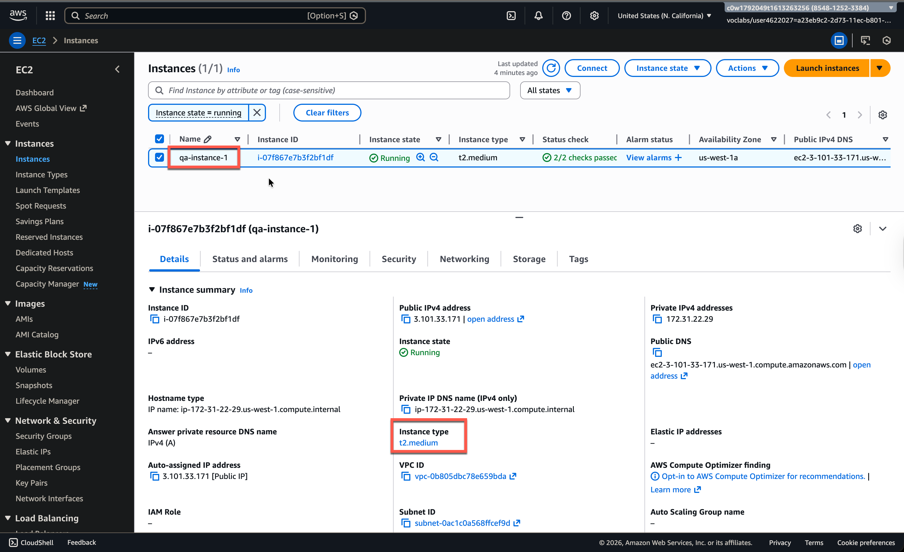

**`qa-instance-1` Utiliziation Before Changes**


**Instance Volumes Before Changes**
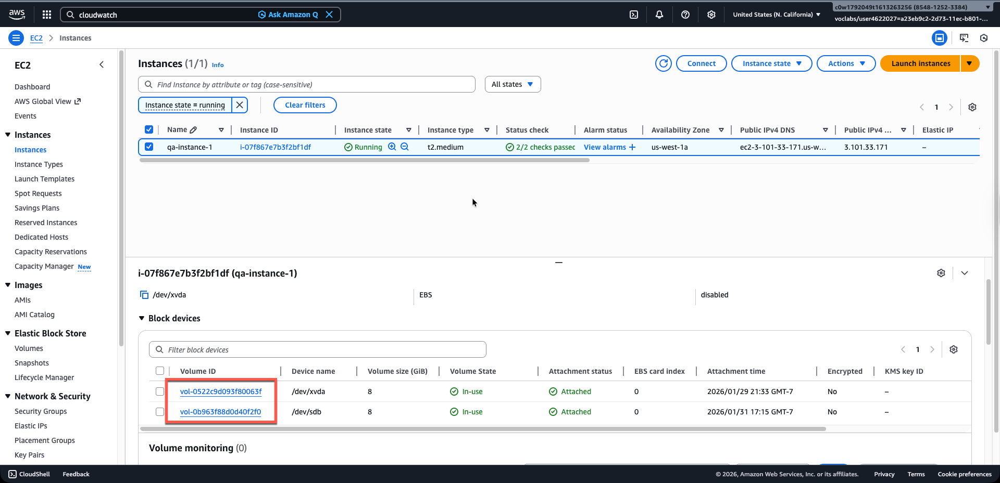

**Second Volume Settings Before Changes**
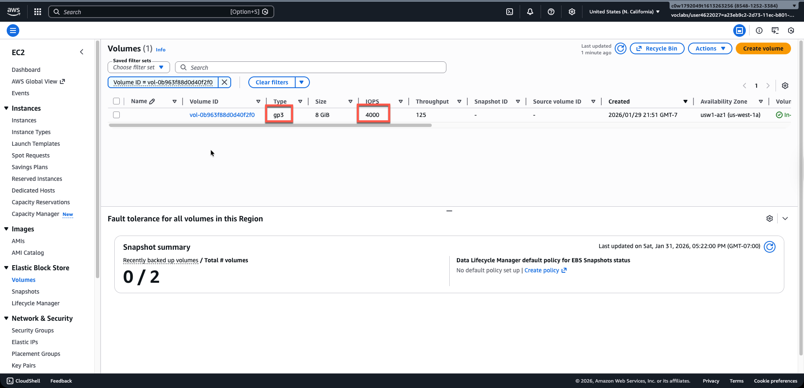

**Took Image Snapshot Before Changes**
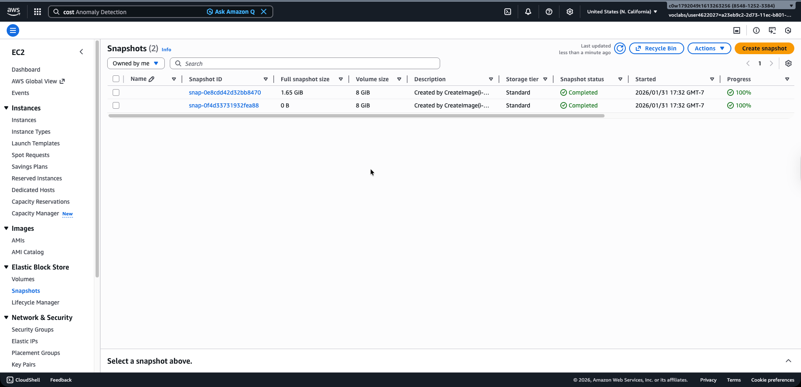

**New Instance Type: t2.small**
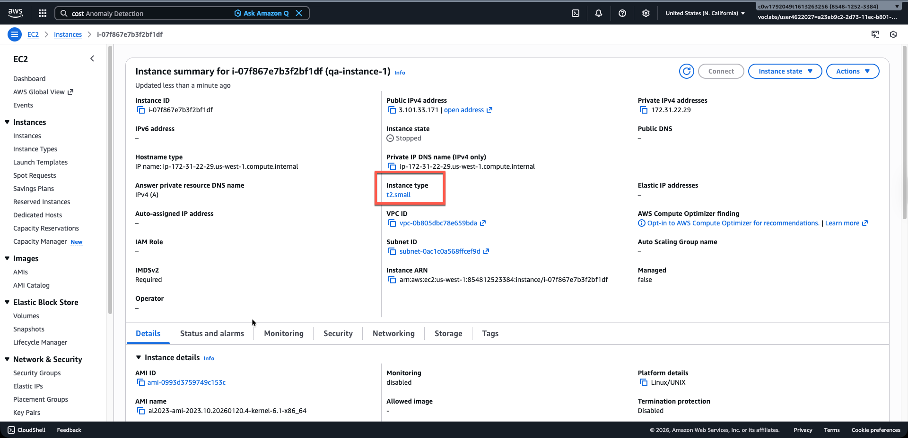

**New Storage IOPS: 3000**
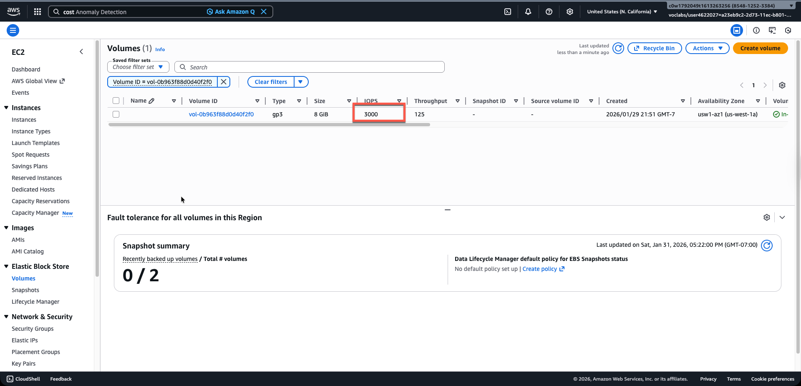

---

## Task 5 — NAT Gateway vs NAT Instance: Cost and Trade-Off Analysis

### Scenario
You’re working for a SaaS startup, DevMetrics, which has backend microservices hosted in private subnets in two Availability Zones (AZs). These services require outbound internet access to fetch security updates and connect to external APIs.

Currently, the architecture uses a NAT Gateway in each AZ, but the monthly bill is rising due to the amount of data transferred (~1000GB/month).

Management has asked you to compare the cost of the NAT Gateway and NAT Instances.

Business Requirements:

- Compare monthly cost of NAT Gateway vs NAT Instance for 1000GB/month
- Create a table that compares the NAT Gateway to the NAT Instance for HA, Performance, Scalability, and Maintenance

### Rubric

- Submit documentation of cost estimates and comparison
  - Include screen shots or PDF of calculations, and table of comparison for NAT Gateway vs NAT Instance.

### Student Submission

### Cost Comparison: NAT Gateway vs NAT Instance

#### Assumptions
- **Region:** US East (N. Virginia) — us-east-1
- **Data Transfer:** 1,000 GB/month outbound
- **Architecture:** 2 Availability Zones (requiring 2 NAT solutions for HA)
- **NAT Instance Type:** t3.nano (baseline ~32 Mbps, burst up to 5 Gbps when CPU credits available)

#### Sources Used for Cost Estimates
1. **AWS Pricing Calculator** — https://calculator.aws/
2. **AWS NAT Gateway Pricing** — https://aws.amazon.com/vpc/pricing/
3. **AWS EC2 Pricing** — https://aws.amazon.com/ec2/pricing/on-demand/

---

### NAT Gateway Cost Calculation

| Cost Component | Calculation | Monthly Cost |
|----------------|-------------|--------------|
| NAT Gateway hourly charge | $0.045/hour × 730 hours × 2 AZs | $65.70 |
| Data processing charge | $0.045/GB × 1,000 GB | $45.00 |
| **Total NAT Gateway** | | **$110.70/month** |

*Note: Data transfer out to the internet is charged separately and applies equally to both solutions. NAT Gateway “data processing” is an additional per-GB charge on top of internet egress.*

---

### NAT Instance Cost Calculation

| Cost Component | Calculation | Monthly Cost |
|----------------|-------------|--------------|
| EC2 t3.nano On-Demand | $0.0052/hour × 730 hours × 2 AZs | $7.59 |
| EBS Storage (8 GB gp3 × 2) | $0.08/GB × 8 GB × 2 | $1.28 |
| **Total NAT Instance** | | **$8.87/month** |

**With Reserved Instances (1-year, no upfront):**

| Cost Component | Calculation | Monthly Cost |
|----------------|-------------|--------------|
| EC2 t3.nano Reserved | $0.0033/hour × 730 hours × 2 AZs | $4.82 |
| EBS Storage (8 GB gp3 × 2) | $0.08/GB × 8 GB × 2 | $1.28 |
| **Total NAT Instance (RI)** | | **$6.10/month** |

---

### Cost Comparison Summary

| Solution | Monthly Cost | Annual Cost | Savings vs NAT Gateway |
|----------|--------------|-------------|------------------------|
| NAT Gateway (2 AZs) | $110.70 | $1,328.40 | — |
| NAT Instance On-Demand (2 AZs) | $8.87 | $106.44 | **92% savings** |
| NAT Instance Reserved (2 AZs) | $6.10 | $73.20 | **94% savings** |

**Potential Annual Savings: ~$1,200 - $1,255**

---

### Feature Comparison: NAT Gateway vs NAT Instance

| Feature | NAT Gateway | NAT Instance |
|---------|-------------|--------------|
| **High Availability** | Highly available within a single AZ. Deploy one per AZ for multi-AZ HA. Automatic failover within AZ. | No built-in HA. Requires manual setup: scripts, Auto Scaling groups, or multiple instances with health checks. Single point of failure without custom HA solution. |
| **Performance** | Up to 100 Gbps bandwidth. Scales automatically based on demand. No bottleneck concerns. | Limited by EC2 instance type bandwidth. t3.nano: baseline ~32 Mbps, burst up to 5 Gbps (credit-dependent). Requires larger instance for higher sustained throughput. Can become a bottleneck under heavy load. |
| **Scalability** | Fully managed auto-scaling. No intervention required. Handles traffic spikes seamlessly. | Manual scaling required. Must monitor and resize instances. May require instance type change or additional NAT instances for increased demand. |
| **Maintenance** | Zero maintenance. Fully managed by AWS. No patching, no OS updates, no security hardening. | Full maintenance responsibility: OS patching, security updates, NAT software configuration, monitoring, troubleshooting. Requires operational overhead. |
| **Security Groups** | Cannot be associated with Security Groups. Use NACLs for traffic control. | Can use Security Groups for fine-grained traffic control. More flexible security options. |
| **Bastion Host** | Cannot be used as a bastion host. | Can double as a bastion/jump host for SSH access to private instances. |
| **Port Forwarding** | Not supported. | Supports port forwarding with iptables configuration. |
| **Cost Model** | Hourly charge + per-GB data processing. Predictable but higher base cost. | EC2 instance cost only. Lower base cost but operational overhead has hidden costs. |

---

### Recommendation

| Factor | Recommendation |
|--------|----------------|
| **Cost-sensitive, low traffic** | NAT Instance — Significant savings (~92%) for 1000 GB/month |
| **Production-critical workloads** | NAT Gateway — Fully managed, no operational risk |
| **High throughput requirements** | NAT Gateway — Auto-scaling up to 100 Gbps |
| **Limited operational staff** | NAT Gateway — Zero maintenance burden |

**For DevMetrics' use case:**

Given the 1,000 GB/month data transfer and the concern about rising monthly bills, I recommend evaluating NAT Instances if:
- The team has operational capacity to manage EC2 instances
- The workload can tolerate brief outages during instance failures
- Cost savings of ~$1,200/year justifies the additional operational overhead

If operational simplicity and reliability are priorities, NAT Gateway remains the better choice despite higher costs.

---

### Screenshots

**NAT Gateway Estimate**
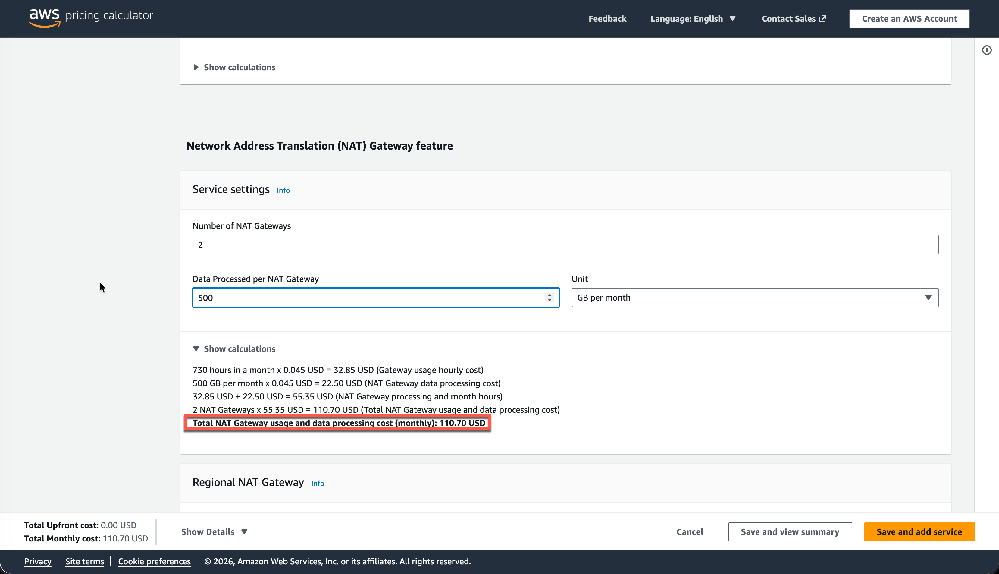

**On-Demand NAT Instance Estimate**
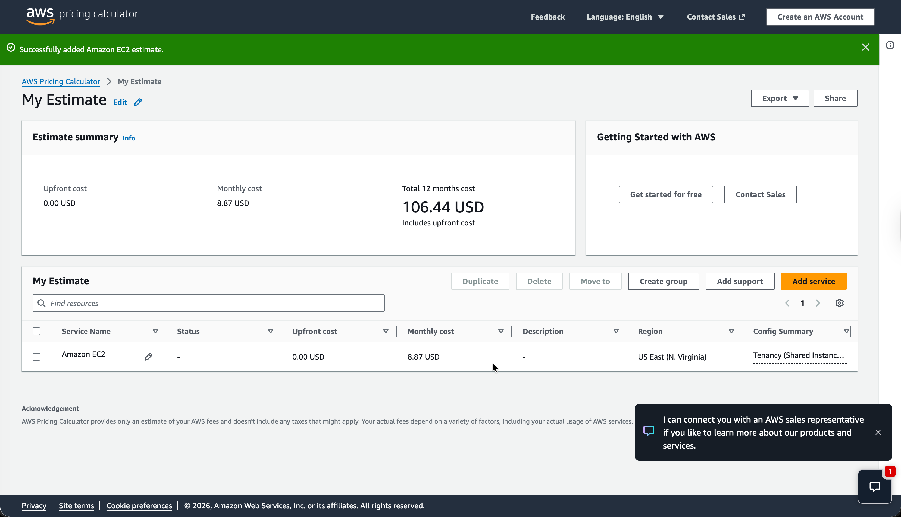

**Reserved NAT Instance Estimate**

